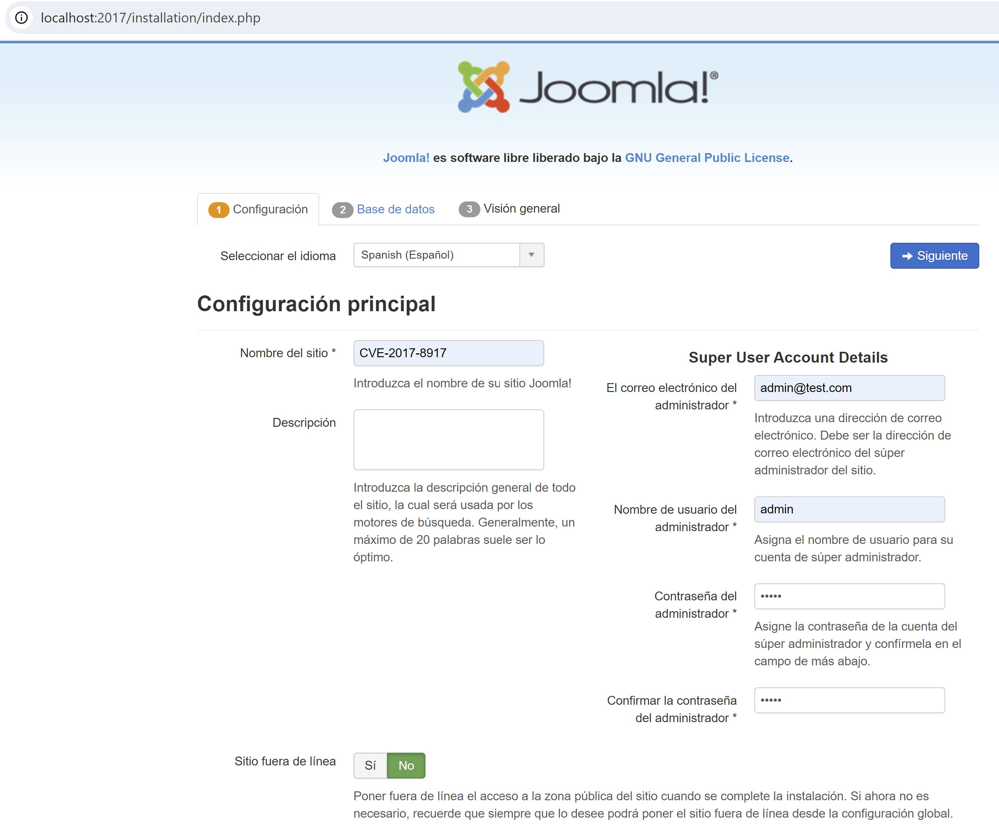
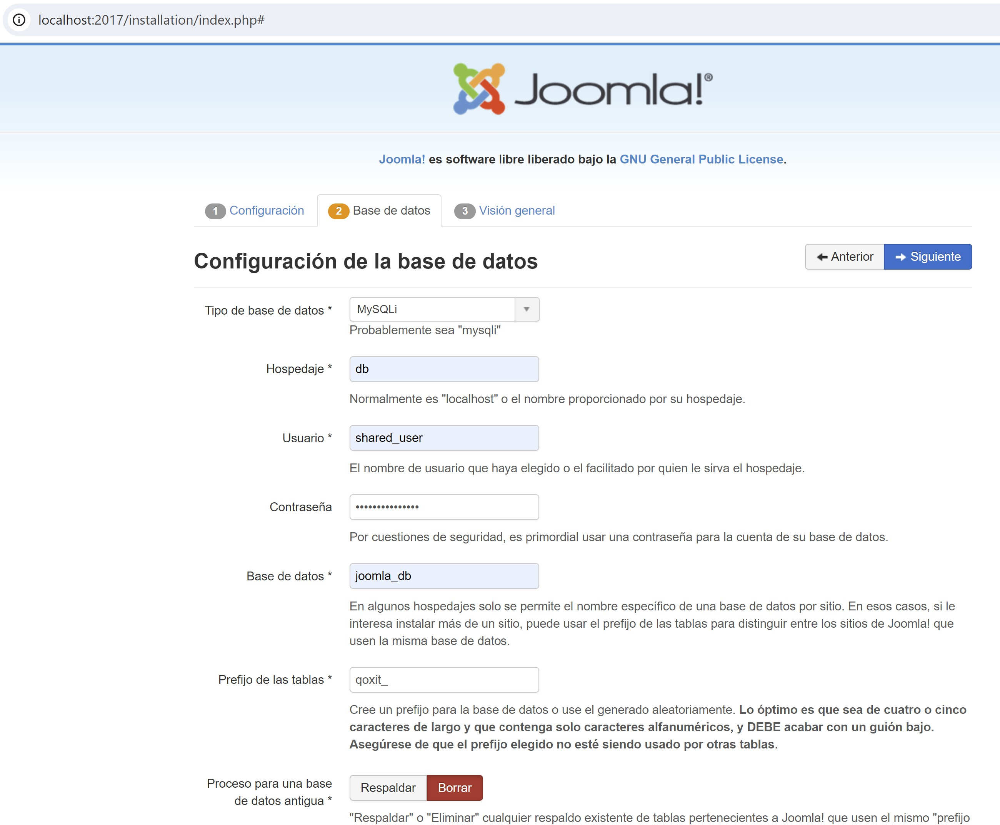

# demo-forense-sqli

En este repositorio se dispondrán los recursos para la demo de la charla "SQLi:  Gestión de Incidentes con un enfoque práctico.".

## Descripción:

En la charla analizaremos estrategias prácticas a aplicar en las diversas fases de gestión de un incidente, utilizando como ejemplo un caso práctico de SQLi. Comenzaremos con el triage para confirmar la presencia del incidente y determinar su naturaleza. Profundizaremos en el análisis forense, no solo para identificar los indicadores de compromiso a través de ejemplos de parseo de logs, sino también para determinar cuáles datos fueron efectivamente comprometidos. Este análisis es técnicamente desafiante pero esencial para cumplir con los requisitos de protección de datos personales. Describiremos las medidas efectivas para la mitigación del impacto y la remediación de las vulnerabilidades.  En particular detallaremos cómo el uso de web application firewalls (WAF) nos puede ayudar en muchas de las tareas descritas. Por último, veremos lecciones aprendidas y haremos una discusión sobre futuras investigaciones en colaboración con la comunidad, incluyendo la potencial aplicación de inteligencia artificial en el análisis forense.

## Contenido detallado de la presentación:

- Presentación del ambiente de laboratorio.
- Explicación del ataque.
- Análisis forense de los logs.
- Contención (WAF).
- Remediación.
- Trabajos futuros utilizando IA como asistente.

[La presentación se puede acceder aquí](./2024_SQLi%20Gestión%20de%20Incidentes%20con%20un%20enfoque%20practico.pdf)


## Armado del ambiente de laboratorio:

El ambiente de laboratorio consta de tres contenedores Docker, los mismos son:

1. **MySQL (db)**: Este contenedor corre una instancia de MySQL 5.7, que actúa como la base de datos backend compartida para las aplicaciones web de Joomla.
   - **Imagen**: `mysql:5.7`
   - **Puertos**: No expuesto directamente.
   - **Volúmenes**: Persistencia de datos en `db_data`.
   - **Configuración**: Base de datos compartida para Joomla con un usuario común (`shared_user`).

2. **Joomla (joomla_app)**: Contenedor que corre Joomla 3.7.0, una plataforma de CMS que contiene una vulnerabilidad SQLi ciega (CVE-2017-8917). Este será el objetivo de los ataques SQLi durante la demo.
   - **Imagen**: `joomla:3.7.0-apache`
   - **Puertos**: `2017:80`
   - **Volúmenes**: 
     - `./output/joomla-apache2-logs:/var/log/apache2` para almacenar logs de Apache.
     - `joomla_data:/var/www/html` para persistencia de datos.
   - **Configuración**: Configurado para conectar a la base de datos MySQL compartida.

3. **SQLMap (sqlmap_tool)**: Este contenedor contiene la herramienta SQLMap configurada para ejecutar automáticamente ataques SQLi. Los resultados de los ataques se almacenan en un directorio de salida.
   - **Imagen**: Construida desde un Dockerfile personalizado.
   - **Volúmenes**: 
     - `./analisis:/analisis` para scripts de análisis.
     - `./output/sqlmap:/sqlmap-output` para almacenar los resultados de los ataques.
     - `./output/joomla-apache2-logs:/output/joomla-apache2-logs` para acceder a los logs de Apache generados por Joomla.
   - **Configuración**: Ejecuta un script que automatiza los ataques SQLi contra la instancia de Joomla y almacena los resultados para su posterior análisis.

## Instrucciones de uso:

1. **Construir y lanzar el ambiente**:
   Ejecuta el siguiente comando para construir las imágenes personalizadas y lanzar los contenedores:

   ```bash
   docker-compose up -d
   ```

### Instalación de Joomla

A continuación, se presentan los pasos para la instalación de Joomla:

#### Paso 1: Configuración Principal

En este primer paso, configura el nombre del sitio, el correo electrónico del administrador y otros detalles necesarios.



#### Paso 2: Configuración de la Base de Datos

Aquí, debes configurar la conexión a la base de datos. Asegúrate de ingresar los detalles correctos para conectar Joomla a la base de datos MySQL.

Por defecto se debe configurar:
- `Hospedaje` db
- `Usuario` shared_user
- `Contraseña` shared_password
- `Prefijo de las tablas` qoxit_



#### Paso 3: Visión General

En este paso, puedes optar por instalar datos de ejemplo o continuar con una instalación limpia.


#### Paso 4: Finalización de la Instalación

Una vez que completes los pasos anteriores, Joomla procederá a la instalación final. No olvides eliminar la carpeta de instalación al final.


#### Joomla Instalado

Una vez que está instalado, el contenedor con SQLMap comenzará el ataque automáticamente.


### Log del ataque de SQLMap

Si revisamos los logs del contenedor `sqlmap_tool`, podremos ver el avance del ataque. Puede demorar unos cuantos minutos, pero al terminar deberíamos ver la siguiente salida:


## Análisis de logs

Lo primero que vamos a hacer es ejecutar un script en Python para generar un archivo Excel con los logs de cada paso en una hoja.

   ```bash
   docker exec -it sqlmap_tool bash

   python3 /analisis/logs_to_excel.py
   ```
